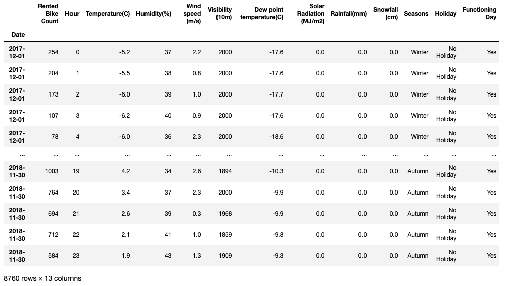
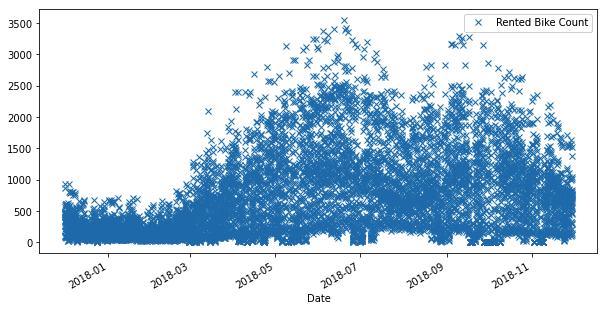

# EDA + Regression

# Seoul Bike Sharing Demand Data Set

[https://archive.ics.uci.edu/ml/datasets/Seoul+Bike+Sharing+Demand](https://archive.ics.uci.edu/ml/datasets/Seoul+Bike+Sharing+Demand#)

This dataset(from Seoul!) contains the number of bikes rented per hour and other information like date, temperature, humidity, etc. of one year.

1. Using Jupyter notebook(not mandatory, any similar tools are ok), please see the data and share your thoughts or insights. It can be anything so feel free to start with simple one. You can refer Kaggle site([www.kaggle.com](http://www.kaggle.com)) to see how other experts are doing it.
2. Time span of the data is from 2017-12-01 to 2018-12-01. We hope that you can do regression to predict 'Rented Bike Count' for the last month of this period(2018-11-01 to 2018-12-01) and review the result with ground truth.

Example - Data

Example - Plot

